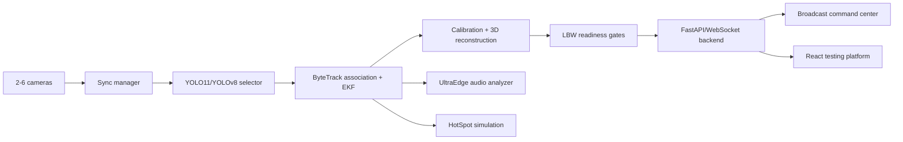

# Cricket DRS - Professional Decision Review System

[](https://github.com/NikhilSai-4409/DRS/actions/workflows/ci.yml)

Cricket DRS is an engineering-grade prototype for cricket decision review workflows. It combines multi-camera capture, replay, YOLO-based ball detection, ball tracking, calibration, LBW gates, UltraEdge-style audio analysis, clean DRS animation, and operator dashboards.

The system does not claim vendor-grade accuracy without real validation data. If model metrics, calibration, sync, tracking, replay FPS, or confidence gates are missing or below threshold, decisions are marked `REVIEW INCONCLUSIVE`.

## Architecture



## Prerequisites

- Python 3.11 recommended
- Node.js 20+
- Optional RTX GPU with CUDA 12.9
- For tournament testing: calibrated high-FPS cameras and a validated cricket-specific model

## Install

CPU-safe install:

```powershell
python -m venv .venv
.\.venv\Scripts\Activate.ps1
pip install -r requirements.txt
```

RTX/CUDA install:

```powershell
python -m venv .venv
.\.venv\Scripts\Activate.ps1
pip install -r requirements-gpu.txt
```

Install Electron dashboard dependencies:

```powershell
cd dashboard\electron
npm install
cd ..\..
```

Install testing-platform dependencies:

```powershell
cd dashboard\testing-platform
npm install
cd ..\..
```

## Run

Live FastAPI backend for Electron:

```powershell
.\.venv\Scripts\python.exe drs_app.py --api --cameras 0,1,2,3,4,5 --record
```

Electron broadcast dashboard:

```powershell
cd dashboard\electron
npm start
```

Offline upload testing backend:

```powershell
.\.venv\Scripts\python.exe drs_app.py --testing-api --host 127.0.0.1 --port 8766
```

React testing platform:

```powershell
cd dashboard\testing-platform
npm run dev
```

Headless OpenCV mode:

```powershell
.\.venv\Scripts\python.exe drs_app.py --cameras 0,1 --headless --seconds 120
```

Desktop launcher:

```powershell
powershell -ExecutionPolicy Bypass -File scripts\create_testing_platform_shortcut.ps1
```

## Configuration

Copy `.env.example` to `.env` and adjust ports, log level, sync tolerance, replay buffer, and decision thresholds as needed.

The detector selector prefers:

1. `models/yolo11x.pt`
2. `models/yolo11l.pt`
3. `models/yolov8x.pt`
4. `models/cricket_ball_yolov8.pt`

Model files are ignored by default except committed placeholders. Add validated model metrics with:

```powershell
.\.venv\Scripts\python.exe scripts\evaluate_yolo_drs.py --model models\training_runs\drs_yolov8\weights\best.pt
```

## Calibration

Capture checkerboard images for each camera under final match placement, zoom, focus, and exposure.

```powershell
.\.venv\Scripts\python.exe scripts\calibrate.py --cameras 0,1 --images-dir data\calibration\images
```

Write measured readiness metrics after validation:

```powershell
.\.venv\Scripts\python.exe scripts\write_calibration_readiness.py --reprojection-error-px 1.1 --homography-error-cm 3.5 --pitch-coordinate-error-cm 4.0
```

## Accuracy Gates

`OUT`, `NOT OUT`, and `UMPIRE'S CALL` are only shown when all gates pass:

- model mAP50 >= 0.88
- ball recall >= 0.90
- calibration reprojection error <= 1.5 px
- homography validation error <= 5 cm
- tracking reliability medium/high
- max missing detection gap <= 5 frames
- sync error <= 8 ms
- replay FPS >= 24
- decision confidence >= 70%

Otherwise the system reports `REVIEW INCONCLUSIVE`.

## Tests

Install package in editable mode, then run tests:

```powershell
pip install -e .
pytest tests/ -v --tb=short
```

Or from venv:

```powershell
.\.venv\Scripts\python.exe -m pip install -e .
.\.venv\Scripts\python.exe -m pytest tests/ -v --tb=short
```

## Documentation

- `docs/ACCURACY_PLAYBOOK.md`
- `docs/DRS_TESTING_PLATFORM.md`

## Contributing

Keep changes modular, run tests after each phase, and never remove readiness warnings unless replacing them with measured validation metrics.

## License

No license is currently declared. Add a license before public production distribution.
