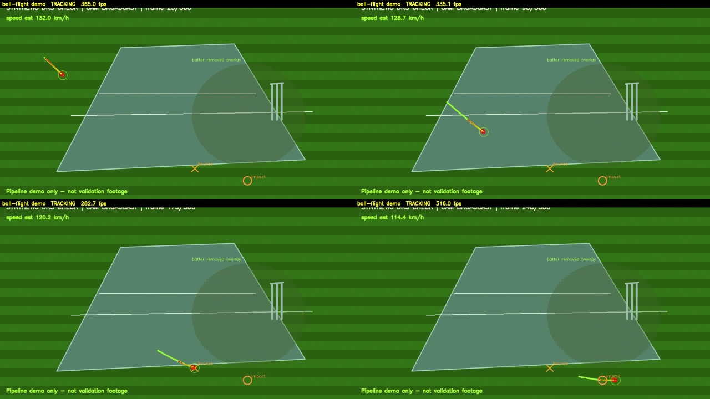

# DRS — Cricket Decision Review System

A computer-vision pipeline for cricket ball tracking and LBW analysis, built to
run on real match footage. This repo is **honest about what one fixed camera can
and cannot do**: it tracks ball flight reliably and is engineered to scale up to
full multi-camera LBW once DRS-grade footage is available.

> **TL;DR** — The *software* (detection, tracking, LBW engine, decision gates,
> dashboards) is built and works. On a single wide camera it delivers a
> **real-time ball-flight tracker**. Full LBW (pitching/impact/hitting-stumps)
> needs tighter, faster, multi-camera footage — see [docs/CAMERA_SPEC.md](docs/CAMERA_SPEC.md).

---

## Table of contents
- [What this does (and doesn't)](#what-this-does-and-doesnt)
- [Proof it works](#proof-it-works)
- [How it works (pipeline)](#how-it-works-pipeline)
- [Setup](#setup)
- [Usage — step by step](#usage--step-by-step)
- [Inputs & outputs](#inputs--outputs)
- [Dashboards (web UI)](#dashboards-web-ui)
- [Testing](#testing)
- [Accuracy gates](#accuracy-gates)
- [Project structure](#project-structure)
- [Key findings (why these design choices)](#key-findings-why-these-design-choices)
- [Roadmap](#roadmap)

---


| Capability | Status | Notes |
|---|---|---|
| Track the ball in **open play / shots** | ✅ works | Real-time, motion-based, no training |
| **Real-time** ball-flight overlay (live trail) | ✅ works | ~300 fps on CPU on a 884×670 crop |
| Auto-find deliveries / ball arcs in a clip | ✅ works | Trajectory linking + classification |
| Pitch-plane calibration (pixel → mm) code | ✅ exists | Validated only with proper footage |
| Full **LBW** (pitching, impact, hitting stumps) | ⚠️ needs better footage | Delivery ball is ~5 px on current wide footage → below detection floor |
| UltraEdge / HotSpot | ⛔ not usable | No thermal camera / validated synced mic |

**Why the honesty matters:** real DRS (Hawk-Eye) uses 6–10 high-speed (≥100 fps)
calibrated cameras so the ball is 30+ px and 3D depth is recoverable. With one
distant wide camera the ball during a delivery is a few pixels and merges with
players — no software fixes that. This project ships the part that *does* work
today and documents exactly what footage unlocks the rest. When gates fail,
decisions are honestly marked `REVIEW INCONCLUSIVE` / `UMPIRE'S CALL`.

---

## Proof it works

**Real-time ball-flight demo** (red marker = ball, fading trail = path, top bar =
live status/fps). Frames from `scripts/realtime_ball_demo.py`:



**Measured on real match footage (3 clips, motion tracker):**
- A struck ball tracked cleanly: **12 points, straightness 1.00**.
- `find` mode auto-detected **~450 ball-like arcs/clip**, 169 in-corridor delivery
  candidates across 3 clips.
- Confirmed limitation: delivery-zone arcs merge with players (the reason LBW
  needs the camera re-shoot).

> Real-footage proof images are reproducible with the commands below once the
> match clips are available (drive was offline at packaging time).

---

## How it works (pipeline)

```
                         ┌─────────────── single fixed camera ───────────────┐
 video / live camera ──► crop fixed pitch ROI (0.27,0.28,0.73,0.90)
                         │
                         ├─► 3-frame differencing  ──► fast small blobs (the ball)
                         │
                         ├─► trajectory linking     ──► ball-like arcs (reject player jitter)
                         │
                         ├─► Kalman filter           ──► smooth + bridge occlusion gaps
                         │
                         ├─► pitch-plane homography  ──► pixel → real pitch mm   [needs calibration]
                         │
                         └─► LBW engine + readiness gates ──► OUT / NOT OUT / UMPIRE'S CALL / INCONCLUSIVE
```

**Why motion, not YOLO?** On this wide footage a generic YOLO ball model
false-fires on players/umpire shirts and misses the tiny ball. The camera is
*fixed*, so 3-frame differencing isolates the fastest small object (the ball)
with **no training and no labels**. This is the right tool for a fixed camera.

---

## Setup

Requirements: Python 3.12+ (repo uses 3.14), a virtualenv, `ffmpeg`, Node.js 20+
(only for the dashboards). CPU is fine — no GPU required.

```bash
git clone https://github.com/devanathsugavasi/DRS.git
cd DRS

python3 -m venv venv
source venv/bin/activate          # a .venv -> venv symlink also exists
pip install -r requirements.txt   # torch, ultralytics, opencv, fastapi, scipy, ...

cp .env.example .env              # adjust ports / thresholds if needed
```

> **First run is slow** — cold import of torch can take minutes on macOS
> (Gatekeeper scans the binaries). Subsequent runs are <1 s. This is normal;
> don't kill it. CPU is forced via `INFERENCE_DEVICE=cpu` in `.env`.

---

## Usage — step by step

All commands assume the venv is active and you're in the repo root.

### 1. Preview ball detection on any clip
```bash
python scripts/preview_detect.py --video path/to/clip.MTS --start 0 --duration 10
# → annotated JPGs in preview_out/ ; open them to eyeball detections
```

### 2. Real-time ball-flight demo (the headline feature)
```bash
# windowed live playback on a clip
python scripts/realtime_ball_demo.py --video path/to/clip.MTS

# jump to an action window, save an annotated mp4 (no window)
python scripts/realtime_ball_demo.py --video path/to/clip.MTS \
    --start 389 --duration 4 --save demo_out.mp4 --no-display

# live USB camera
python scripts/realtime_ball_demo.py --camera 0
```
Output: a live window (press `q` to quit) and/or an annotated `.mp4`, plus a
processed-fps print. Red circle = ball, fading trail = path.

### 3. Find ball arcs / deliveries across a whole clip
```bash
python scripts/motion_ball_finder.py find --video path/to/clip.MTS --out deliveries_out
# → deliveries_out/deliveries.json : every ball-like arc (timing, length,
#   straightness, speed, delivery/across classification)
```
Other modes: `scan` (motion energy per second), `track` (annotate a window to mp4).

### 4. Export a track in the pipeline's JSON format
```bash
python scripts/motion_ball_finder.py export --video path/to/clip.MTS \
    --start 389 --duration 4 --out ball_track.json
# → ball_track.json : [{frame, x, y, confidence, speed_kmh}, ...]
#   (speed_kmh needs --px-per-m from calibration; 0 otherwise)
```

### 5. Run the full offline pipeline (detection → track → LBW → decision)
```bash
python scripts/validate_full_pipeline.py --video test_delivery.mp4 --max-frames 120
# → prints the decision summary + readiness gates; writes job outputs
```

### 6. Build a training crop dataset (optional)
```bash
python scripts/extract_pitch_crops.py --source path/to/clips_folder \
    --output training_crops --frame-stride 15 --max-frames-per-video 250
```

---

## Inputs & outputs

| Tool | Input | Output |
|---|---|---|
| `preview_detect.py` | video clip | annotated JPGs in `preview_out/` |
| `realtime_ball_demo.py` | video / camera | live window + optional `.mp4`, processed fps |
| `motion_ball_finder.py find` | video clip | `deliveries.json` (arcs, timing, metrics) |
| `motion_ball_finder.py export` | video window | `ball_track.json` (`frame,x,y,confidence,speed_kmh`) |
| `validate_full_pipeline.py` | video | LBW decision + readiness gates + job artifacts |

Tracking JSON shape (drop-in for the pipeline / dashboards):
```json
{
  "source": "clip.MTS", "fps": 50.0, "calibrated": false,
  "tracking": [
    {"frame": 19534, "x": 522, "y": 122, "confidence": 1.0, "speed_kmh": 0.0},
    {"frame": 19535, "x": 548, "y": 113, "confidence": 1.0, "speed_kmh": 0.0}
  ]
}
```

---

## Dashboards (web UI)

**React testing platform** — upload a clip, inspect ball track / speed / decision:
```bash
# backend
python drs_app.py --testing-api --host 127.0.0.1 --port 8766
# frontend (new terminal)
cd dashboard/testing-platform && npm install && npm run dev
# → open http://127.0.0.1:5173 , upload a clip, watch results populate
```

**Electron broadcast dashboard** (live ops):
```bash
cd dashboard/electron && npm install && npm start
```

**Live API (multi-camera, aspirational — needs the camera setup):**
```bash
python drs_app.py --api --cameras 0,1 --record
```

---

## Testing

**Unit tests:**
```bash
pip install -e .
pytest tests/ -v --tb=short
```

**Manual end-to-end test (input → output proof):**
1. Generate a synthetic delivery: `python scripts/generate_test_video.py --output test_delivery.mp4 --duration 10 --fps 30`
2. Run the real-time demo on it: `python scripts/realtime_ball_demo.py --video test_delivery.mp4 --roi "0,0,1,1" --save demo_out.mp4 --no-display`
3. Open `demo_out.mp4` — you should see the red ball marker + trail following the ball (see proof image above).

---

## Accuracy gates

`OUT` / `NOT OUT` / `UMPIRE'S CALL` are shown **only** when all gates pass;
otherwise `REVIEW INCONCLUSIVE`:

- model mAP50 ≥ 0.88, ball recall ≥ 0.90
- calibration reprojection error ≤ 1.5 px, homography error ≤ 5 cm
- tracking reliability medium/high, max missing-detection gap ≤ 5 frames
- sync error ≤ 8 ms, replay FPS ≥ 24, decision confidence ≥ 70 %

On a single wide camera the height/calibration gates correctly fail → the system
returns `UMPIRE'S CALL` / `INCONCLUSIVE`. That is honest behavior, by design.

---

## Project structure

```
core/              detection, tracking, LBW engine, calibration, decision, gates, APIs
scripts/           CLI tools:
  motion_ball_finder.py    scan / track / find / export  (the working ball tracker)
  realtime_ball_demo.py    real-time ball-flight overlay
  preview_detect.py        eyeball detections on a clip
  extract_pitch_crops.py   build YOLO crop dataset
  validate_full_pipeline.py  end-to-end offline run
dashboard/         React testing UI + Electron broadcast dashboard
docs/              MASTER_PLAN, CAMERA_SPEC, SESSION1_REPORT, PROJECT_OVERVIEW, images/
archive/           dead duplicate modules kept for history (not used by live code)
config/settings.py global constants (camera, thresholds, pitch dims, audio)
tests/             unit tests
```

---

## Key findings (why these design choices)

1. **Generic YOLO fails** on this footage — labels umpires/red jerseys, misses the
   ~5 px ball. Auto-labeling produced ~66 % garbage. **Do not retrain on this data.**
2. **Motion tracking works** because the camera is fixed — proven on a real ball
   (straightness 1.00).
3. **Delivery-zone tracking is footage-limited**, not code-limited: the ball at the
   bounce/impact is below the detection floor and merges with players. Confirmed
   three ways (per-frame, corridor-filtered, Kalman-stitched).
4. **One camera cannot do true 3D / height** — no depth from a single view. So
   "hitting the stumps" is honestly gated to `UMPIRE'S CALL` / `INCONCLUSIVE`.

Full reasoning in [docs/MASTER_PLAN.md](docs/MASTER_PLAN.md) and
[docs/SESSION1_REPORT.md](docs/SESSION1_REPORT.md).

---

## Roadmap

- **Now:** real-time ball-flight tracker (done); shot/fielding analysis on current footage.
- **Next (needs footage):** re-shoot per [docs/CAMERA_SPEC.md](docs/CAMERA_SPEC.md)
  (2+ fixed cameras, ≥100 fps, ball ≥30 px) → calibrate pitch plane → real
  pitching/line LBW calls → feed `core/lbw_engine.py` → full decision flow.
- **Later:** second square-leg camera unlocks true 3D height and stump projection.

---

*Built as an honest, incrementally-upgradeable DRS. The code is ready; it scales
with the cameras you give it.*
