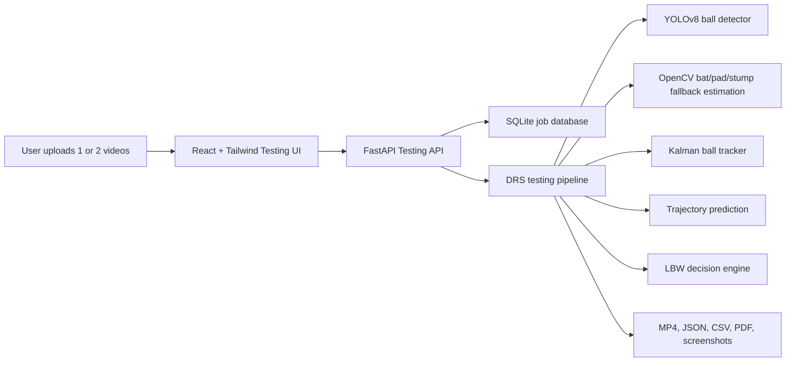

# Cricket DRS Testing Platform

Offline upload-based testing system for validating cricket deliveries before live tournament deployment.

## Architecture



The platform runs fully offline after dependencies and model files are installed locally. It supports:

- Single camera delivery analysis
- Dual camera synchronized analysis
- Ball detection and confidence scoring
- Ball tracking with Kalman smoothing
- Bounce and impact point estimation
- Trajectory and wicket-impact prediction
- LBW recommendation with uncertainty
- DRS-style analyzed video and reports

## Folder Structure

```text
core/
  testing_api.py          FastAPI upload/job/export API
  testing_database.py     SQLite schema and persistence
  testing_pipeline.py     Offline video analysis pipeline
dashboard/
  testing-platform/
    index.html
    package.json
    src/App.jsx           React dashboard
    src/styles.css        Tailwind/CSS broadcast styling
data/
  testing/
    uploads/              ignored uploaded videos
    outputs/              ignored generated reports/videos
    drs_testing.sqlite3   ignored local job database
models/
  cricket_ball_yolov8.pt  local YOLOv8 cricket ball model
```

## Database Design

`analysis_jobs`

| Column | Purpose |
| --- | --- |
| id | Job ID |
| mode | single_camera or dual_camera |
| status | queued, processing, complete, failed |
| options_json | Enabled analysis options |
| video_a_path | First uploaded video |
| video_b_path | Optional second video |
| created_at_ms | Local creation time |
| updated_at_ms | Last state update |
| result_json | DRS result payload |
| error | Failure details |

`tracking_points`

| Column | Purpose |
| --- | --- |
| job_id | Parent analysis job |
| camera_id | Camera index in upload |
| frame_id | Video frame number |
| timestamp_ms | Frame timestamp |
| x, y | Tracked ball position |
| confidence | Detector/tracker confidence |
| predicted | Whether Kalman prediction filled a missing detection |

## API Design

Base URL: `http://127.0.0.1:8766`

| Method | Endpoint | Purpose |
| --- | --- | --- |
| GET | `/api/testing/health` | Offline backend health and feature list |
| POST | `/api/testing/jobs` | Upload one or two videos and start processing |
| GET | `/api/testing/jobs/{job_id}` | Get job status/result |
| POST | `/api/testing/jobs/{job_id}/reprocess` | Re-run with new options |
| GET | `/api/testing/jobs/{job_id}/exports/video` | Download analyzed MP4 |
| GET | `/api/testing/jobs/{job_id}/exports/pdf` | Download DRS report |
| GET | `/api/testing/jobs/{job_id}/exports/json` | Download tracking JSON |
| GET | `/api/testing/jobs/{job_id}/exports/csv` | Download tracking CSV |

`POST /api/testing/jobs` accepts multipart form fields:

- `video_a`: required video file
- `video_b`: optional second synchronized camera video
- `options_json`: JSON string with analysis toggles

Example options:

```json
{
  "ball_detection": true,
  "ball_tracking": true,
  "trajectory_prediction": true,
  "lbw_analysis": true,
  "edge_detection": true,
  "replay_generation": true,
  "confidence_threshold": 0.25
}
```

## Deployment Instructions

Backend:

```powershell
cd C:\Users\nikhi\OneDrive\Desktop\DRS
.\.venv\Scripts\python.exe -m pip install -r requirements.txt
.\.venv\Scripts\python.exe drs_app.py --testing-api --host 127.0.0.1 --port 8766
```

Frontend:

```powershell
cd C:\Users\nikhi\OneDrive\Desktop\DRS\dashboard\testing-platform
npm install
npm run dev
```

Open:

```text
http://127.0.0.1:5174
```

## Calibration And Training Readiness

Current status:

- Camera calibration code is ready for testing, but production DRS needs checkerboard captures from the exact cameras, lenses, zoom settings, and pitch layout used at the ground.
- The YOLO model file loads and can detect a ball, but tournament accuracy needs training/validation on your own red-ball and white-ball footage, with motion blur, sunlight, shadows, pads, bat, stumps, and crowd backgrounds.
- Bat, pad, and stump detection currently uses geometry fallback boxes in the upload-testing pipeline. For stronger LBW decisions, train a multi-class YOLO model with classes: `ball`, `bat`, `front_pad`, `back_pad`, `stumps`, `crease`.

This is good enough to start offline testing workflows. It is not yet enough for official match decisions.
